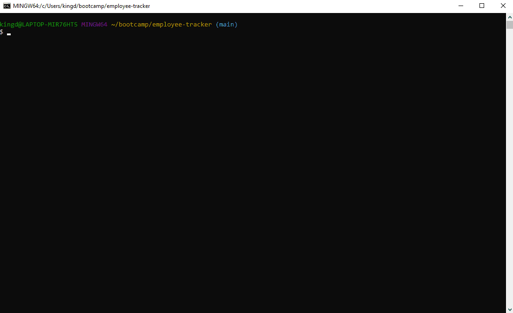

# Bootcamp Homework 12 - MySQL: Employee Tracker

[](https://opensource.org/licenses/MIT)
## Description
This is a coding bootcamp homework assignment to architect and build a solution for managing a company's employees using node, [inquirer](https://www.npmjs.com/package/inquirer), and [MySQL](https://www.npmjs.com/package/mysql). The command-line application allows a user to:

  * Add departments, roles, employees

  * View departments, roles, employees

  * Update employee roles

  * And more...

## Table of Contents
* [Installation](#Installation)
* [Usage](#Usage)
* [Demo](#Demo)
* [Contributing](#Contributing)
* [Questions](#Questions)
* [License](#License)

## Installation
Install the following dependencies: 
```bash
npm install
npm install inquirer
npm install mysql
npm install console.table
npm install figlet
```
The application database schema contains three tables:


* **department**:

  * **id** - INT PRIMARY KEY
  * **name** - VARCHAR(30) to hold department name

* **role**:

  * **id** - INT PRIMARY KEY
  * **title** -  VARCHAR(30) to hold role title
  * **salary** -  DECIMAL to hold role salary
  * **department_id** -  INT to hold reference to department role belongs to

* **employee**:

  * **id** - INT PRIMARY KEY
  * **first_name** - VARCHAR(30) to hold employee first name
  * **last_name** - VARCHAR(30) to hold employee last name
  * **role_id** - INT to hold reference to role employee has
  * **manager_id** - INT to hold reference to another employee that manages the employee being Created. This field may be null if the employee has no manager

**Sample `schema.sql` & `seed.sql` files are provided in `/db` folder**

## Usage
Execute the Employee Tracker with 
```bash
node employeeTracker.js
```
## Demo
The application is run from the command-line:



**A full demo can be found [here](https://drive.google.com/file/d/1hcNuZC-dd99eOsZZ9Dpe1YVe_7XlsPnp/view?usp=sharing).**

## Contributing
Fork the repo and submit a pull request to enhance the code or fix a bug

## Questions
Have questions?  Contact me on [GitHub](https://github.com/thorgriffs) or email <22.kelliking@gmail.com>

## License

  >MIT License
  >
  >Copyright (c) 2020 Kelli King
  >
  >Permission is hereby granted, free of charge, to any person obtaining a copy
  of this software and associated documentation files (the "Software"), to deal
  in the Software without restriction, including without limitation the rights
  to use, copy, modify, merge, publish, distribute, sublicense, and/or sell
  copies of the Software, and to permit persons to whom the Software is
  furnished to do so, subject to the following conditions:
  >
  >The above copyright notice and this permission notice shall be included in all
  copies or substantial portions of the Software.
  >
  >THE SOFTWARE IS PROVIDED "AS IS", WITHOUT WARRANTY OF ANY KIND, EXPRESS OR
  IMPLIED, INCLUDING BUT NOT LIMITED TO THE WARRANTIES OF MERCHANTABILITY,
  FITNESS FOR A PARTICULAR PURPOSE AND NONINFRINGEMENT. IN NO EVENT SHALL THE
  AUTHORS OR COPYRIGHT HOLDERS BE LIABLE FOR ANY CLAIM, DAMAGES OR OTHER
  LIABILITY, WHETHER IN AN ACTION OF CONTRACT, TORT OR OTHERWISE, ARISING FROM,
  OUT OF OR IN CONNECTION WITH THE SOFTWARE OR THE USE OR OTHER DEALINGS IN THE
  SOFTWARE.